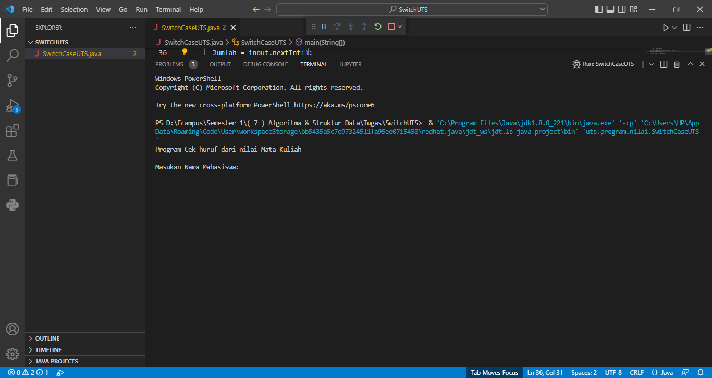
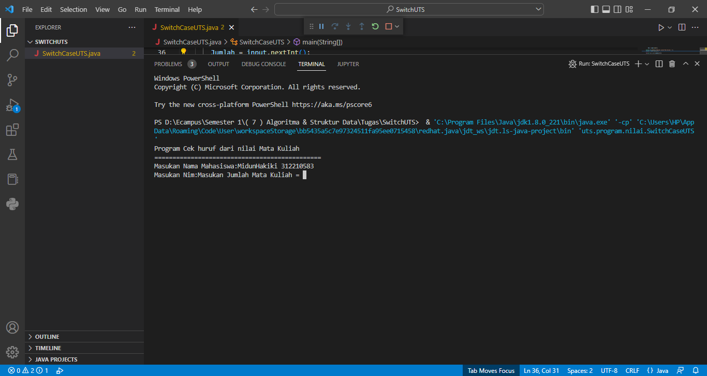
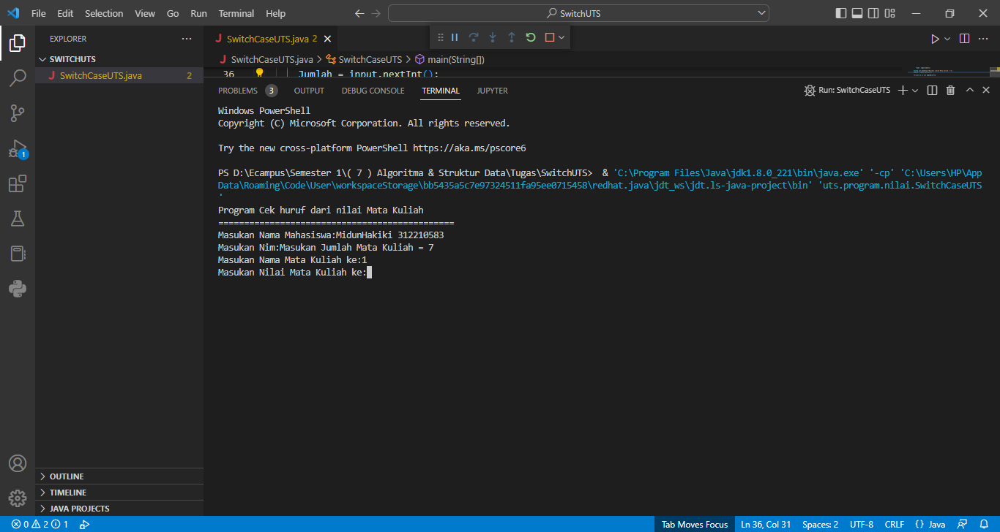
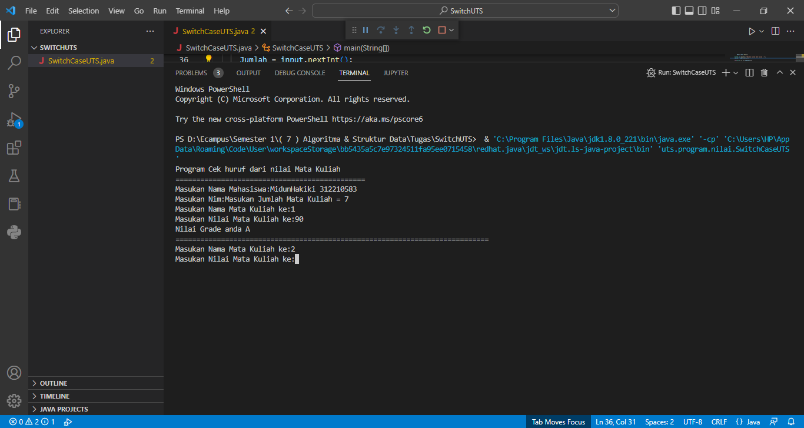
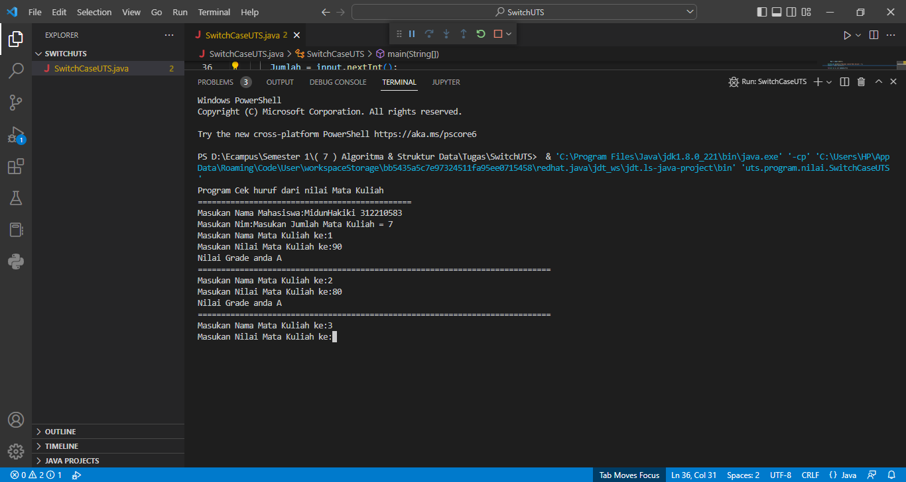
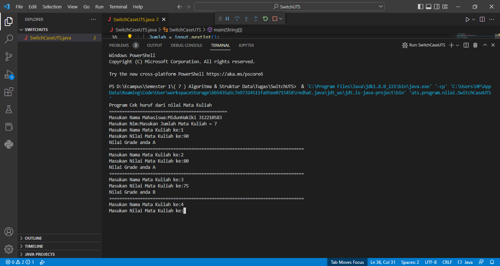
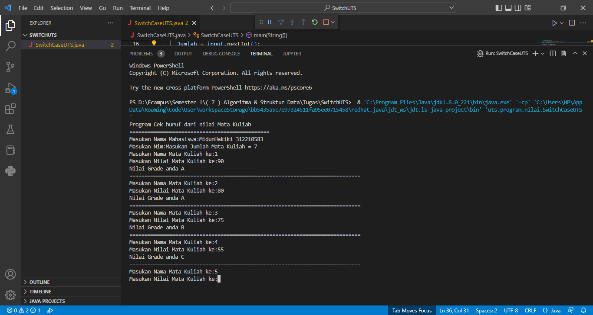
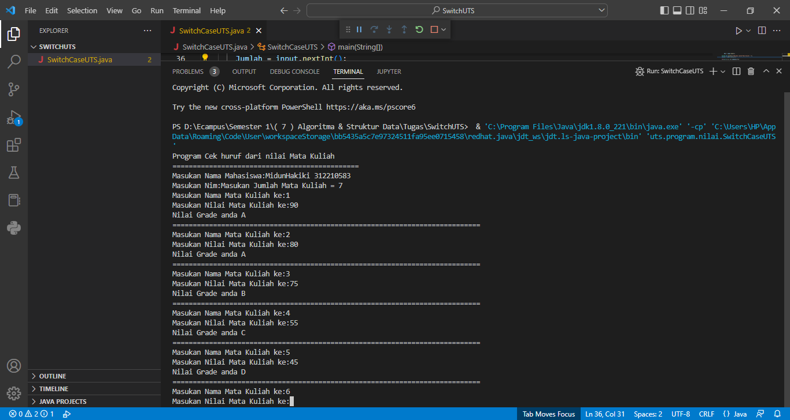
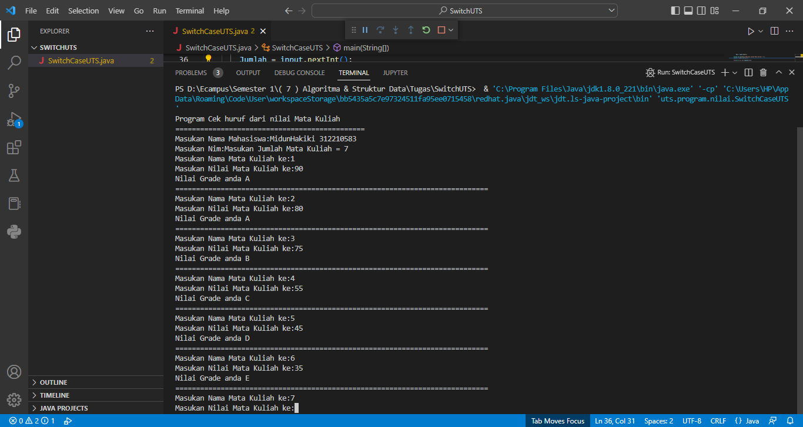
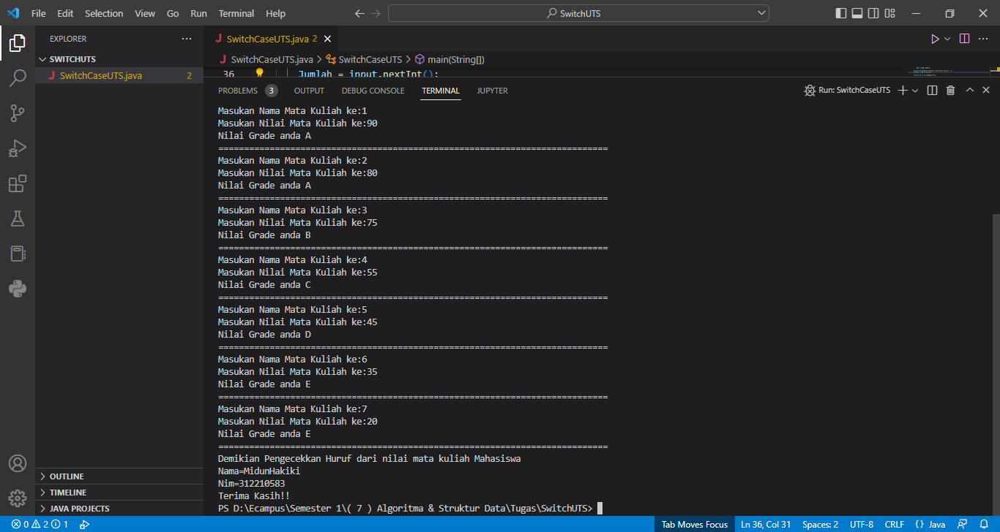

#   Nama   = Midun Hakiki
#   Nim    = 312210583
#   Prodi  = Teknik Informatika

#   Langkah-Langkah Program Java Cara Membuat Nilai UTS LULUS & TIDAK LULUS

1.)   Berikut adalah contohnya :

    /*
    * To change this license header, choose License Headers in Project Properties.
    * To change this template file, choose Tools | Templates
    * and open the template in the editor.
    */

    package uts.program.nilai;

    /**
    *
    * @author HP
    */
    import java.util.Scanner;
    public class SwitchCaseUTS{

        /**
        * @param args the command line arguments
        */
        public static void main(String[] args) {
            // TODO code application logic here
        
            Scanner input = new Scanner(System.in);
        
            String Nama, Nim;
            int nilai, Jumlah;
            System.out.println("Program Cek huruf dari nilai Mata Kuliah");
            System.out.println("==============================================");
        
            System.out.print("Masukan Nama Mahasiswa:");
                Nama = input.next();
        
            System.out.print("Masukan Nim:");
                Nim = input.next();
        
            System.out.print("Masukan Jumlah Mata Kuliah = ");
            Jumlah = input.nextInt();
        
            for(int i= 1; i<= Jumlah;i++){
        
                System.out.println("Masukan Nama Mata Kuliah ke:"+i);
            
                System.out.print("Masukan Nilai Mata Kuliah ke:");
                    nilai=input.nextInt();
                
                    switch ((nilai >= 80 && nilai <= 100)?0:
                    (nilai >= 60 && nilai <= 79)?1:
                    (nilai >= 50 && nilai <= 59)?2:
                    (nilai >= 40 && nilai <= 49)?3:
                    (nilai <= 39 && nilai >=0)?4:5){
                    
                        case 0:
                    
                          System.out.println("Nilai Grade anda A");

                          break;
                        case 1: 

                          System.out.println("Nilai Grade anda B");
                          break;
                        case 2:

                          System.out.println("Nilai Grade anda C");
                          break;
                        case 3:

                          System.out.println("Nilai Grade anda D");
                          break;
                        case 4:

                          System.out.println("Nilai Grade anda E");
                          break;
                    
                        case 5:
                    
                          System.out.println("TIDAK LULUS UJIAN");
                          break;
                    }
                
                    System.out.println("============================================================================");
            }        
        
                    System.out.println("Demikian Pengecekkan Huruf dari nilai mata kuliah Mahasiswa");
                    System.out.println("Nama="+Nama);
                    System.out.println("Nim="+Nim);
                
                    System.out.println("Terima Kasih!!");
  
        } 
    }

2.)   Ini adalah hasilnya setelah di Run kan :

    - Masukkan nama dan nim terlebih dahulu.

    - Inilah contoh setelah memasukan nama dan nim seperti gambar di bawah ini

    - Masukkan jumlah mata kuliah (disini bebas mau isi jumlah berapa saja, dan disini saya isi jumlahnya 7) seperti gambar di bawah.

    - Masukkan nilai mata kuliah
        a.)   untuk mengetahui nama mata kuliah yang pertama, disini saya masukkan nilai 90 agar terdapat nilai A.

 
        b.)   Dan untuk mengulang mengetahui nama mata kuliah yang kedua, disini saya masukkan nilai 80 biar tetap
              terdapat nilai A, seperti gambar di bawah ini.

    -   masukkan nama mata kuliah yang ketiga, disini saya masukkan nilai mata kuliah yaitu 75, Agar terdapat
        nilai B, seperti gambar di bawah ini.

    -   masukkan nama mata kuliah yang keempat, disini saya masukkan nilai mata kuliah yaitu 55, Agar terdapat
        nilai C, seperti gambar di bawah ini.

    -   masukkan nama mata kuliah yang kelima, disini saya masukkan nilai mata kuliah yaitu 45, Agar terdapat
        nilai D, seperti gambar di bawah ini.

    -   masukkan nama mata kuliah yang keEnam, disini saya masukkan nilai mata kuliah yaitu 35, Agar terdapat
        nilai E, seperti gambar di bawah ini.

    -   masukkan nama mata kuliah yang ketujuh, disini saya masukkan nilai mata kuliah yaitu 20, Agar terdapat
        nilai E, seperti gambar di bawah ini.

#    INILAH HASILNYA
#    TERIMAKASIH...
#    SALAM SEHATI TEKNIK INFORMATIKA
#    MIDUN HAKIKI (312210583)

